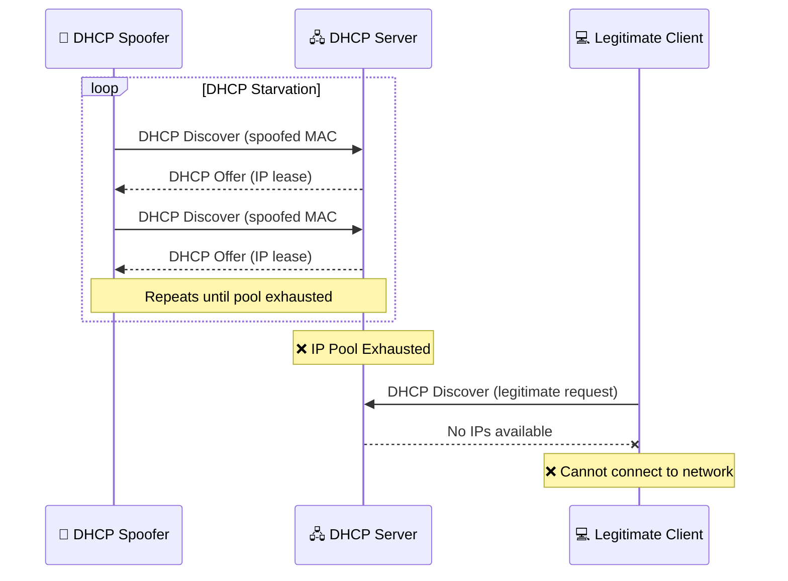

<p align="center">
  
  
  
  
  
</p>

<h1 align="center">📡 DHCP Spoofer</h1>

<p align="center">
  <strong>DHCP Starvation & Spoofing attack tool with a modern dark-themed GUI.</strong><br>
  Leverages Yersinia to flood the network with rogue DHCP offers, enabling network disruption testing.
</p>

---

> [!CAUTION]
> **LEGAL DISCLAIMER — READ BEFORE USE**
>
> This tool performs **DHCP Spoofing / Starvation attacks**, which can disrupt network services for all
> connected devices. Unauthorized use on networks you do not own or do not have **explicit written
> permission** to test is **illegal** in most jurisdictions and may result in criminal prosecution.
>
> The authors assume **no liability** for any misuse, damage, or legal consequences.
> **Use exclusively in isolated lab environments or with written authorization from the network owner.**

---

## 📑 Table of Contents

- [Features](#-features)
- [How It Works](#-how-it-works)
- [Attack Flow](#-attack-flow)
- [Requirements](#-requirements)
- [Installation](#-installation)
- [Usage](#-usage)
- [Project Structure](#-project-structure)
- [Contributing](#-contributing)
- [License](#-license)

---

## ✨ Features

| Feature | Description |
|---|---|
| 📡 **DHCP Starvation** | Floods the network with DHCP Discover packets to exhaust the DHCP pool |
| 🎯 **Interface Selector** | Dropdown menu to choose the active network interface |
| 🖥️ **Modern Dark GUI** | Intuitive interface built with CustomTkinter |
| 📋 **Live Output Log** | Real-time Yersinia output displayed in the application |
| 🛡️ **Root Verification** | Checks for root privileges before execution |
| 🔍 **Yersinia Detection** | Verifies Yersinia is installed before attempting attacks |
| ⚡ **Safe Process Control** | Proper process management — no `os.system` or `pkill` |
| 🚪 **Graceful Shutdown** | Automatically terminates Yersinia on window close |

---

## 🧠 How It Works

**DHCP Starvation** is a Layer 2 denial-of-service attack that targets the DHCP server:

1. **Exhaustion** — The attacker sends a massive number of DHCP Discover packets with spoofed MAC addresses, requesting IP leases for each.
2. **Pool Depletion** — The legitimate DHCP server assigns IPs to each request until its address pool is completely exhausted.
3. **Denial of Service** — New legitimate clients that connect to the network cannot obtain an IP address via DHCP, effectively denying them network access.
4. **Rogue DHCP (optional)** — With the real server's pool empty, the attacker can set up a rogue DHCP server to assign malicious configurations (gateway, DNS) to new clients, enabling man-in-the-middle attacks.

> [!NOTE]
> This tool uses **Yersinia** (`-attack 1`), which performs DHCP Discovery flooding. The attack operates at
> **Layer 2** (Data Link Layer) and only affects devices within the same broadcast domain.

---

## 🏗️ Attack Flow



---

## 📋 Requirements

| Requirement | Details |
|---|---|
| **Python** | 3.8 or higher |
| **OS** | Linux only (Kali, Ubuntu, Debian, Arch) |
| **Privileges** | Root (`sudo`) — required for raw packet operations |
| **Yersinia** | Network attack framework — must be installed |
| **Network** | Must be connected to the target LAN |

---

## 🔧 Installation

### 1. Clone the Repository

```bash
git clone https://github.com/Jairo-RC/DHCP-ARP-Spoofer.git
cd DHCP-ARP-Spoofer
```

### 2. Install Yersinia

```bash
# Debian / Ubuntu / Kali
sudo apt update && sudo apt install yersinia -y

# Arch Linux
sudo pacman -S yersinia
```

### 3. Install Python Dependencies

```bash
pip install -r requirements.txt
```

---

## 🚀 Usage

### Quick Start

```bash
sudo python3 src/dhcp_spoof.py
```

### Workflow

1. **Launch** — Run the application with root privileges. The tool verifies that Yersinia is installed and root access is available.
2. **Select Interface** — Choose your network interface from the dropdown (e.g., `eth0`, `wlan0`).
3. **Start Attack** — Click **"⚡ Start Attack"** to begin DHCP starvation. Yersinia output is displayed in real time.
4. **Monitor** — The live log panel shows all Yersinia output as the attack progresses.
5. **Stop Attack** — Click **"⏹ Stop Attack"** to safely terminate the Yersinia process.

> [!WARNING]
> This attack will affect **all devices** on the same broadcast domain. Never run this on a production network.
> Always use an **isolated lab environment**.

---

## 📁 Project Structure

```
DHCP-ARP-Spoofer/
├── src/
│   └── dhcp_spoof.py         # Main application (GUI + attack logic)
├── requirements.txt          # Python dependencies
├── .gitignore                # Git ignore rules
├── LICENSE                   # MIT License
└── README.md                 # This file
```

---

## 🤝 Contributing

Contributions are welcome! If you'd like to improve this project:

1. **Fork** the repository
2. **Create** a feature branch: `git checkout -b feature/your-feature`
3. **Commit** your changes: `git commit -m "Add: your feature description"`
4. **Push** to the branch: `git push origin feature/your-feature`
5. **Open** a Pull Request

### Ideas for Contribution

- [ ] Rogue DHCP server mode
- [ ] Packet capture and logging (PCAP export)
- [ ] Attack intensity control (packets/sec throttling)
- [ ] Network reconnaissance before attack
- [ ] ARP Spoofing integration

---

## 📜 License

This project is licensed under the **MIT License** — see the [LICENSE](LICENSE) file for details.

---

<p align="center">
  <strong>Test responsibly. Isolated labs only. 📡🛡️</strong><br>
  <sub>Made with ❤️ by <a href="https://github.com/Jairo-RC">Jairo RC</a></sub>
</p>
